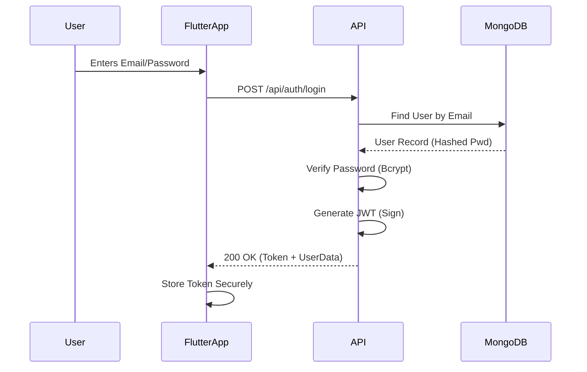
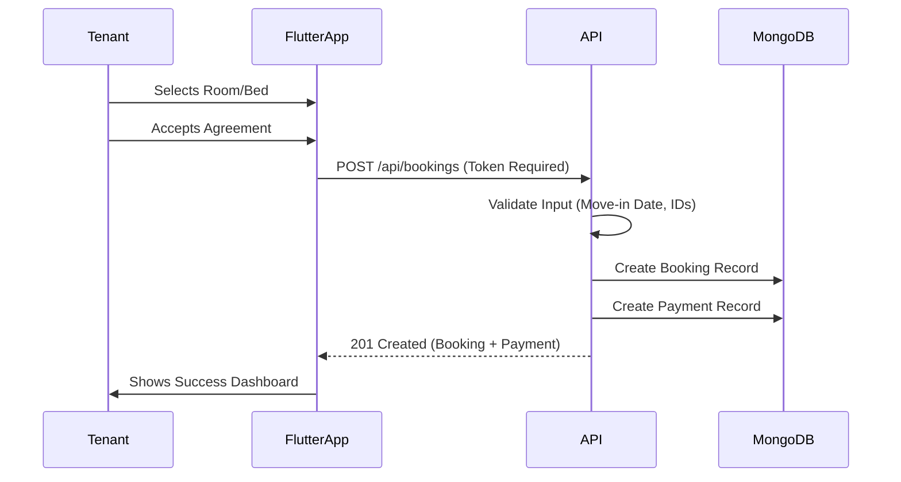
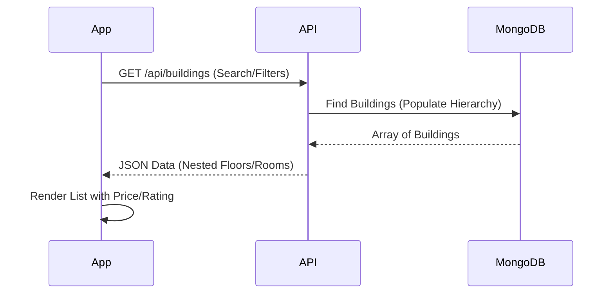

# API & Logic Flow Diagrams

Visual representation of the core processes in the Hostel Hub system.

## 1. Authentication Flow

```mermaid
sequenceDiagram
    participant User
    participant FlutterApp
    participant API
    participant MongoDB

    User->>FlutterApp: Enters Email/Password
    FlutterApp->>API: POST /api/auth/login
    API->>MongoDB: Find User by Email
    MongoDB-->>API: User Record (Hashed Pwd)
    API->>API: Verify Password (Bcrypt)
    API->>API: Generate JWT (Sign)
    API-->>FlutterApp: 200 OK (Token + UserData)
    FlutterApp->>FlutterApp: Store Token Securely
```

## 2. Booking Flow

```mermaid
sequenceDiagram
    participant Tenant
    participant FlutterApp
    participant API
    participant MongoDB

    Tenant->>FlutterApp: Selects Room/Bed
    Tenant->>FlutterApp: Accepts Agreement
    FlutterApp->>API: POST /api/bookings (Token Required)
    API->>API: Validate Input (Move-in Date, IDs)
    API->>MongoDB: Create Booking Record
    API->>MongoDB: Create Payment Record
    API-->>FlutterApp: 201 Created (Booking + Payment)
    FlutterApp->>Tenant: Shows Success Dashboard
```

## 3. Hostel Listing Flow

```mermaid
sequenceDiagram
    participant App
    participant API
    participant MongoDB

    App->>API: GET /api/buildings (Search/Filters)
    API->>MongoDB: Find Buildings (Populate Hierarchy)
    MongoDB-->>API: Array of Buildings
    API-->>App: JSON Data (Nested Floors/Rooms)
    App->>App: Render List with Price/Rating
```
